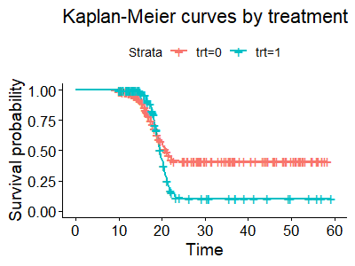

# jmfhc

jmfhc is an R package to fit a new cure model with flexible hazard ratios 
between different covariate subgroups in longitudinal and cure-survival data. 
It is a joint model with individual random effects shared between cure-survival 
and longitudinal submodels and accommodates covariates’ non-proportional hazards 
structures easily. More specifically, this R package can fit a joint model using 
a flexible-hazards cure submodel (JMFHC) and a joint model using a proportional 
hazards submodel (JMPHC) as JMFHC's special case for longitudinal 
and right-censored survival data with a cure fraction. This package also provides 
functions to estimate a patient subgroup's cure rate and survival function 
based on the fitted model. <br />

## What is JMFHC

Our proposed JMFHC consists of a linear mixed-effects model as the longitudinal 
submodel and a flexible-hazards cure (FHC) model as the cure-survival submodel.
An FHC model is in the form of the promotion time cure model and an extension of 
the proportional hazards cure model. The FHC model can be fitted by the R package
fhc at https://github.com/cxie19/fhc.

For subject $i$, the observed values of the biomarker at measurement times 
$\boldsymbol{t_i}$ denoted as $\boldsymbol{b_i}$ are shown as 

$$
  \boldsymbol{b_i}(\boldsymbol{t_i})=
  \boldsymbol{H_i}\boldsymbol{\zeta}+\boldsymbol{D_i}\boldsymbol{\phi}+\boldsymbol{J_i}\boldsymbol{\alpha_i}+\boldsymbol{\epsilon_i},
$$

where $\boldsymbol{H_i}$ is an $n_i \times p^\ast$ matrix for subject $i$'s baseline covariates at measurement times, and its rows are the same and contain any covariates of $\boldsymbol{z_i}$ and $\boldsymbol{x_i}$;
$\boldsymbol{\zeta}$ is a $p^\ast$-length vector of fixed-effect regression parameters for $\boldsymbol{H_i}$;
$\boldsymbol{D_i}$ and $\boldsymbol{J_i}$ are an $n_i \times q^\ast$ design matrix for fixed effects and an $n_i \times r^\ast$ design matrix for random effects, respectively, with the first columns as 1's and the reminding columns containing subject 
$i$'s functions of biomarker measurement time points (e.g., $\boldsymbol{t_i},\log(\boldsymbol{t_i}),\boldsymbol{t_i}^2$), 
and $\boldsymbol{D_i}$ and $\boldsymbol{J_i}$ can have overlapping columns;
$\boldsymbol{\phi}$ is a $q^\ast$-length fixed-effect regression parameter vector containing an intercept for $\boldsymbol{D_i}$;
and $\boldsymbol{\alpha_i}$ is a $r^\ast$-length random-effect regression parameter vector for $\boldsymbol{J_i}$ containing a subject-specific intercept and following a multivariate normal distribution $\mathcal{N}_{r^\ast}(\boldsymbol{0},\boldsymbol{\Sigma})$ and the unstructured covariance matrix $\boldsymbol{\Sigma}$ containing elements of $\sigma_1,...,\sigma_{r^\ast}$ and $\rho_{jm}$, for $j,m = 1,...,r^\ast$ and $j \neq m$.
Then the observed values of the biomarker denoted as $\boldsymbol{b_i}$ for subject $i$ are shown as 
\begin{equation}
\label{eq:linear_mixed_effects_model}
  \boldsymbol{b_i}(\boldsymbol{t_i})=\boldsymbol{B_i}(\boldsymbol{t_i})+\boldsymbol{\epsilon_i}
  =\boldsymbol{H_i}\boldsymbol{\zeta}+\boldsymbol{D_i}\boldsymbol{\phi}+\boldsymbol{J_i}\boldsymbol{\alpha_i}+\boldsymbol{\epsilon_i},
\end{equation}
where $\boldsymbol{\epsilon_i}$ is an $n_i$-length vector of measurement errors following a multivariate normal distribution $\mathcal{N}_{n_i}(\boldsymbol{0},\boldsymbol{R_i}=\sigma_{\epsilon}^2\boldsymbol{I_{n_i}})$.
Here all $\boldsymbol{\alpha_i}$ and $\boldsymbol{\epsilon_i}$ are mutually independent.

The survival function in our joint model (i.e., JMFHC) for subject $i$ at time 
$T$ conditional on covariates $\boldsymbol{z_i}$ and $\boldsymbol{x_i}$ 
and random effects $\boldsymbol{\alpha_i}$ shared with the longitudinal submodel
is assumed to be

$$
    S(t|\boldsymbol{x_i},\boldsymbol{z_i},\boldsymbol{\alpha_i})=\exp\left[-e^{\beta_0}e^{\boldsymbol{z_i'\psi}}e^{\boldsymbol{\alpha_i'\eta}}\{F_0(t)\}^{\exp(\boldsymbol{x_i'\gamma})}\right],
$$

where $\beta_0$ is an unknown scalar; 
$\boldsymbol{\psi}$ and $\boldsymbol{\eta}$ are two vectors of unknown 
regression parameters with lengths $p$ and $p^\ast$ for baseline covariates 
$\boldsymbol{z_i}$ (long-term covariates) and random effects 
$\boldsymbol{\alpha_i}$, respectively;
$F_0(t)$ is a monotone increasing function with $F_0(0)=0$ 
and $\lim_{t\to\infty}F_0(t)=1$;
and $\boldsymbol{\gamma}$ is a vector of unknown regression parameters 
with length $q$ for short-term baseline covariates $\boldsymbol{x_i}$.
JMPHC has $\boldsymbol{\gamma}=\boldsymbol{0}$ in the cure submodel. 


## How to get started

Install the R package using the following commands on the R console:

```{r}
install.packages("devtools")
devtools::install_github("cxie19/jmfhc")
library(jmfhc)
```

An example data set called *jmfhc_dat* is provided in this package. It
is a longitudinal and cure-survival data set. Its documentation can be 
seen by using the following command.

```{r}
help(jmfhc_dat)
```

The function *jmfhc_point_est* is called to obtain point estimation of 
regression parameters and $F_0(t)$ in JMFHC or JMPHC. 
Its documentation can be seen by using the following command.

```{r}
help(jmfhc_point_est)
```

The function *jmfhc_se_est* is called to obtain standard error estimation of
regression parameters and $F_0(t)$ in a JMFHC or JMPHC. Its documentation can 
be seen by using the following command.

```{r}
help(jmfhc_se_est)
```

The function *estcure* is called to compute a cure rate for a patient subgroup 
with specified characteristics given a fitted JMFHC or JMPHC.
Its documentation can be seen by using the following command.

```{r}
help(estcure)
```

The function *est_surv_func* is called to obtain an estimated survival
function for a patient subgroup with specified characteristics given a 
fitted JMFHC or JMPHC. Its documentation can be seen by using the
following command.

```{r}
help(est_surv_func)
```

## Example
For example, we want to fit a JMFHC for the example data *jmfhc_dat*.
This joint model has repeatedly measured biomarker values as the outcome of the 
longitudinal submodel with measurement times as the 
covariate and treatment as the short- and long-term covariate in the cure 
submodel. These two submodels share individual random effects.

We explore the data a little bit to see the Kaplan-Meier curves by treatment.

```{r}
library(survival)
library(dplyr)
library(survminer)
dat_base <- jmfhc_dat %>%
  group_by(patient.id) %>%
  slice_head(n = 1)

fit <- survfit(Surv(event.time, event)~trt, data = dat_base)
ggsurvplot(fit, data = dat_base)
```



We can see the crossing of Kaplan-Meier curves by treatment, indicating the variable treatment's violation of proportional hazards assumption.

We call the function *jmfhc_point_est* for point estimation, and the following command is used.

```{r}
result_coef <- jmfhc_point_est(data=jmfhc_dat, event_time="event.time", event_status="event",
                               id="patient.id", beta_variable="trt", gamma_variable="trt",
                               fu_measure_original="measure",fu_measure="measure",
                               fu_time_original="mes.times",fu_time_fixed_variable="mes.times",
                               fu_time_random_variable="mes.times")
round(result_coef[["coef"]],4)
```
The results of parameter estiamtes are beta_intercept =-0.1383, beta_trt=1.1691, beta_re1=0.5756, beta_re2=-0.7657, gamma_trt=0.8558, fixed_1=5.0171, fixed_2=-1.0242, re_sd_1= 0.8431, re_sd_2=0.4971, re_rho_12=0.0616, and error_sd=0.9878.
                               

With the estimated regression parameters from *result_coef*, 
we compute the cure rates for patient subgroups 
receiving treatment A and treatment B.
We call the function *estcure*, and the following 
commands are used.

```{r}
estcure(object=result_coef,z_value=0) # treatment A
estcure(object=result_coef,z_value=1) # treatment B 
```

The cure rates of patients receiving treatment A and treatment B are 41.48% and 
10.32%, respectively.<br /> 
Meanwhile, with the estimated regression parameters and $F_0(t)$ from 
*result_coef*,  we estimate the survival functions of these two subgroups 
of patients.

```{r}
# treatment A
survival_trt0 <- est_surv_func(object=result_coef,z_value=0,x_value=0) 
# treatment B
survival_trt1 <- est_surv_func(object=result_coef,z_value=1,x_value=1) 
```


